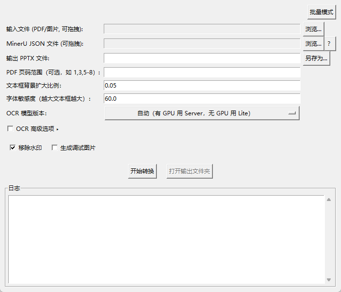
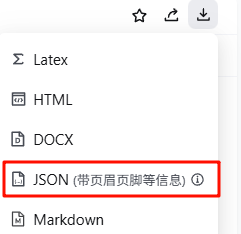

# MinerU 转 PPT 转换器

本工具利用 [MinerU PDF 提取器](https://mineru.net/OpenSourceTools/Extractor) 生成的结构化数据，将 PDF 文件和图片文件转换为可编辑的 PowerPoint 演示文稿（`.pptx`）。它能准确地重建文本、图片和布局，提供一个高保真的、可编辑的原始文档副本。

本应用带有一个为用户设计的图形界面（GUI），简单易用。



## 用户指南：如何使用

作为普通用户，您只需要独立的 `MinerU2PPT.exe` 文件。您无需安装 Python 或任何编程库。

1.  **下载应用程序**: 从本项目的 [Releases 页面](https://github.com/YOUR_USERNAME/YOUR_REPO/releases) 下载最新的 `.exe` 可执行文件。

2.  **获取 MinerU JSON 文件**:
    -   访问 [MinerU PDF/图片提取器](https://mineru.net/OpenSourceTools/Extractor)。
    -   上传您的 PDF 或图片文件，等待其处理完成。
    -   下载生成的 JSON 文件。该文件包含了您的文档结构信息，是本工具进行转换所必需的。
    

3.  **运行转换器**:
    -   双击 `.exe` 文件以启动应用程序。
    -   **选择输入文件**: 将您的 PDF 或图片文件拖拽到第一个输入框中，或使用“浏览...”按钮选择。
    -   **选择 JSON 文件**: 将您从 MinerU 下载的 JSON 文件拖拽到第二个输入框中。
    -   **输出路径**: 您的新 PowerPoint 文件的输出路径将被自动填充。您也可以直接输入路径，或使用“另存为...”按钮来更改。
    -   **选项**:
        -   **移除水印**: 勾选此项可自动擦除 MinerU JSON 中标记为“丢弃”的元素，例如页脚或页码。
        -   **生成调试图片**: 除非您需要排查问题，否则请勿勾选此项。
    -   点击 **开始转换**。

4.  **打开您的文件**: 转换完成后，点击“打开输出文件夹”按钮，即可找到您新生成的 `.pptx` 文件。

## 开发者指南

本部分为需要从源代码运行或打包分发本应用的开发者提供说明。

### 环境配置

1.  克隆本仓库。
2.  建议使用虚拟环境：
    ```bash
    python -m venv venv
    source venv/bin/activate  # 在 Windows 上: venv\Scripts\activate
    ```
3.  从 `requirements.txt` 文件安装所需依赖。
    ```bash
    pip install -r requirements.txt
    ```

### 从源代码运行

-   **运行 GUI 应用程序**:
    ```bash
    python gui.py
    ```
-   **使用命令行界面 (CLI)**:
    ```bash
    python main.py --json <json文件路径> --pdf <pdf文件路径> --output <ppt输出路径> [OPTIONS]
    ```

### 打包为独立可执行文件 (.exe)

您可以将此 GUI 应用打包成单个 `.exe` 文件，方便分发给没有安装 Python 环境的 Windows 用户。

1.  **安装 PyInstaller**:
    ```bash
    pip install pyinstaller
    ```

2.  **构建可执行文件**:
    在项目根目录运行 `pyinstaller` 命令。使用 `--name` 参数为您的应用指定一个专业的名称。
    -   `--windowed`: 防止在运行时出现后台控制台窗口。
    -   `--onefile`: 将所有内容打包到单个可执行文件中。
    -   `--name`: 设置最终生成的可执行文件的名称。

    ```bash
    pyinstaller --windowed --onefile --name MinerU2PPT gui.py
    ```

3.  **找到可执行文件**:
    命令执行完毕后，您将在 `dist` 文件夹中找到独立的应用文件：`MinerU2PPT.exe`。
